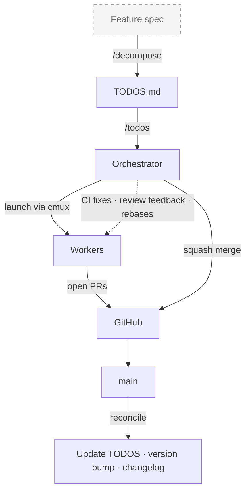

# workflow-kit

Decompose a feature into work items. Run them in parallel. Each gets a full interactive AI coding session. The orchestrator handles CI, reviews, rebasing, and merging. You review and approve the PRs.

Each work item gets its own complete session -- not a sub-task or function call, but a dedicated session with its own context window, tool access, and the full capabilities of whichever AI coding tool you use. You can switch into any worker session to steer it mid-flight, give feedback, or iterate on a PR, while the orchestrator manages the pipeline around them.

Bring your own AI tool, coding conventions, and feature specs. workflow-kit is the orchestration layer.



- **Dependency ordering** -- work items are grouped into batches by their dependencies; batch N+1 starts after batch N is merged
- **Merge strategies** -- merge after approval + CI passes, auto-merge as soon as CI passes, or confirm each merge manually
- **WIP limits** -- rate-limit concurrent sessions (e.g., 5 at a time); auto-start next when a PR opens, keeping the pipeline flowing

Works with Claude Code, OpenCode, Copilot CLI, and any tool supporting the [Agent Skills standard](https://agentskills.io). The tool is auto-detected from the orchestrator's environment.

## Quick Start

```bash
git clone https://github.com/roblambell/workflow-kit.git ~/workflow-kit
cd /path/to/your/project
~/workflow-kit/install.sh
```

One developer runs the install; the rest get the files via `git pull`. Review with `git diff`, then commit.

Or, if you prefer a one-liner:

```bash
bash <(curl -fsSL https://raw.githubusercontent.com/roblambell/workflow-kit/main/remote-install.sh)
```

## What Gets Installed

Everything is **project-level** -- committed to git, shared by the whole team. No per-user project setup needed.

The installer adds: three skills (`/todos`, `/decompose`, `/todo-preview`) via the cross-tool `.agents/skills/` directory, a worker agent installed to all tool-specific agent directories, a CLI script (`scripts/batch-todos.sh`), and project config.

<details>
<summary>Full file inventory</summary>

| Path | Purpose |
|------|---------|
| `scripts/batch-todos.sh` | CLI for work item parsing, worktree management, session launching, PR monitoring |
| `TODOS.md` | Work items (created if missing) |
| `docs/guides/todos-format.md` | TODOS.md format reference |
| `.workflow-kit/config` | Project settings (LOC extensions, domain mappings) |
| `.workflow-kit/domains.conf` | Custom domain slug mappings for section headers |
| `.agents/skills/todos/SKILL.md` | `/todos` -- batch orchestration |
| `.agents/skills/decompose/SKILL.md` | `/decompose` -- feature breakdown |
| `.agents/skills/todo-preview/SKILL.md` | `/todo-preview` -- dev servers |
| `.claude/agents/todo-worker.md` | Worker agent (Claude Code) |
| `.opencode/agents/todo-worker.md` | Worker agent (OpenCode) |
| `.github/agents/todo-worker.agent.md` | Worker agent (Copilot CLI) |

**Skills** use `.agents/skills/` -- the cross-tool standard. One copy, discovered by all tools.

**Agents** are installed to all three tool directories unconditionally -- any team member works regardless of which AI tool they use.

</details>

### Per-user dependencies

Each developer installs these once on their machine:

| Dependency | Purpose | Install |
|------------|---------|---------|
| An AI coding tool | Runs the sessions | Claude Code, OpenCode, Copilot CLI, etc. |
| [gh](https://cli.github.com/) | GitHub CLI for PR operations | `brew install gh` |
| [cmux](https://cmux.com/) | Terminal multiplexer for parallel sessions | See cmux.com |

### Expected skills (bring your own)

Workers reference these skill names during execution. If available, they're used; if not, the worker falls back gracefully.

| Skill | When | Fallback |
|-------|------|----------|
| `/review` | Pre-landing code review | Self-review of the diff |
| `/design-review` | UI/visual changes | Skipped |
| `/qa` | Bug fixes with UI impact | Skipped |
| `/plan-eng-review` | Architecture validation (optional) | Skipped |

[gstack](https://github.com/garrytan/gstack) provides all four out of the box. Or bring your own -- any skill with the matching name and the [SKILL.md standard](https://agentskills.io) will work.

## How It Works

### 1. Decompose

Break a feature into work items:

```
/decompose
```

Or write them directly to `TODOS.md` following `docs/guides/todos-format.md`.

### 2. Process

Launch parallel AI sessions to implement the work items:

```
/todos
```

This orchestrates: SELECT items, LAUNCH parallel sessions, MONITOR for PRs/CI/reviews, MERGE in order, FINALIZE with version bump.

### 3. Standalone CLI

```bash
scripts/batch-todos.sh list --ready          # List ready work items
scripts/batch-todos.sh batch-order H-1 H-2   # Check dependency order
scripts/batch-todos.sh start H-1 H-2         # Launch sessions (auto-detects tool)
scripts/batch-todos.sh status                 # Check worktree status
scripts/batch-todos.sh watch-ready            # Watch PR readiness
scripts/batch-todos.sh version-bump           # Bump version from commits
```

## Project Configuration

### `.workflow-kit/config`

```bash
# File extensions for LOC counting in version-bump
LOC_EXTENSIONS="*.ts *.tsx *.py *.go"
```

### `.workflow-kit/domains.conf`

Map TODOS.md section headers to domain slugs:

```
auth=auth
infrastructure=infra
frontend=frontend
```

## Development / Contributing

If you want to iterate on workflow-kit itself:

```bash
git clone git@github.com:roblambell/workflow-kit.git ~/code/workflow-kit
cd /path/to/your/project
~/code/workflow-kit/install.sh
```

After making changes to workflow-kit, re-run `install.sh` and review the diff.

## Architecture

```
workflow-kit/
├── core/
│   ├── batch-todos.sh          # Universal CLI (auto-detects AI tool)
│   └── docs/todos-format.md
├── skills/                     # Cross-tool SKILL.md files
│   ├── todos/SKILL.md
│   ├── decompose/SKILL.md
│   └── todo-preview/SKILL.md
├── agents/
│   └── todo-worker.md          # Installed to all tool agent directories
├── install.sh                  # Project installer
├── remote-install.sh           # One-liner remote installer
└── README.md
```

**Design principle:** Project-specific context lives in the project's instruction file (`CLAUDE.md`, `AGENTS.md`, etc.), not in workflow-kit. The worker reads the project's instructions for coding conventions, test commands, and architecture docs.

## Updating

Re-run the same command you used to install. Core files are overwritten; project-specific config (`TODOS.md`, `.workflow-kit/config`, `domains.conf`) is preserved.

```bash
# Clone users
~/workflow-kit/install.sh

# One-liner users
bash <(curl -fsSL https://raw.githubusercontent.com/roblambell/workflow-kit/main/remote-install.sh)
```
